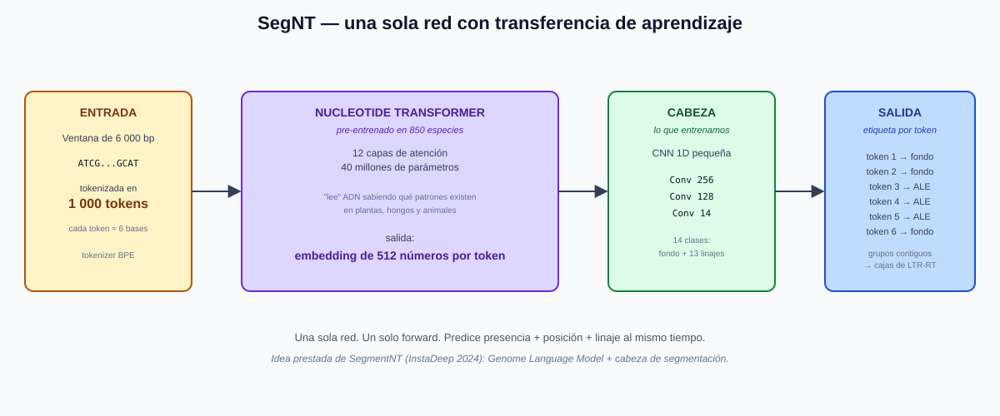
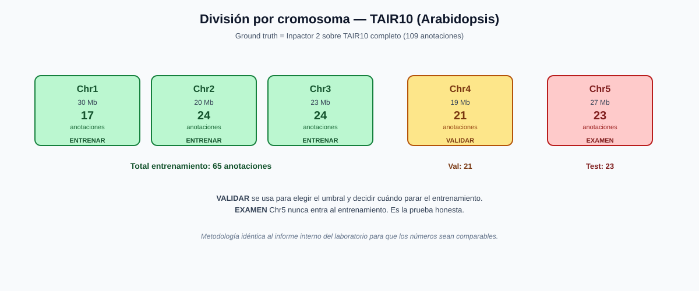
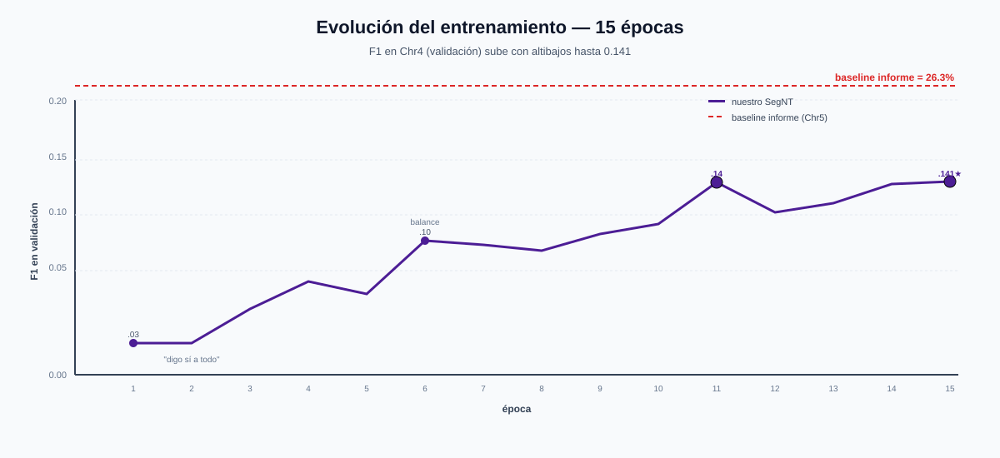
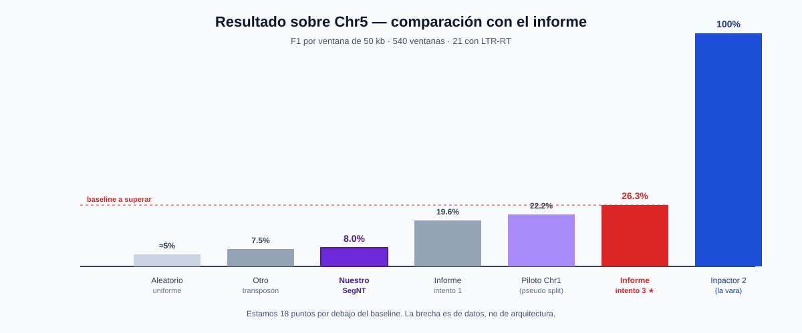

# Presencia en ventanas de 50 kb — Arabidopsis, contra Inpactor 2

**Inpactor3-SegNT** — Genome Language Model con cabeza de segmentación

---

## 1. Presencia en ventanas de 50 kb

Arabidopsis, contra Inpactor 2

**Notas:**

Vamos a ver si nuestra red, en Arabidopsis, marca las mismas ventanas que Inpactor 2. La ventana mide 50 kb. El examen es el cromosoma 5, que la red no vio al entrenar. En este intento cambiamos la red: ahora es un Transformer pre-entrenado en 850 especies, no una CNN desde cero.

---

## 2. La ventana

- 50 000 letras.
- Cuatro canales: A, C, G, T (la N se ignora en el tokenizador BPE).
- La misma en Inpactor 2 y en nuestra red.

**Notas:**

Inpactor 2 y nuestra red ven el mismo pedazo de 50 000 letras. Para meter esas letras al Transformer las agrupamos en tokens de ~6 bases con un tokenizador BPE. La ventana de 50 kb la dividimos en 8 sub-ventanas de 6 000 bases para caber en el modelo, y al final juntamos las etiquetas.

---

## 3. Inpactor 2

- La red de 50 kb solo dice si hay un elemento.
- LTR_FINDER escribe el inicio y el fin.
- Otra red pone el linaje.

**Notas:**

En Inpactor 2 la red de 50 kb solo contesta si hay un elemento. El inicio y el fin los escribe LTR_FINDER. Otra red pone el linaje. La tabla de Arabidopsis, 109 elementos, ya está hecha con esos tres pasos. Es nuestra vara de medir.

---

## 4. Nuestra red — SegNT

- Nucleotide Transformer, 40 millones de parámetros.
- Pre-entrenado en 850 especies.
- Una sola red hace presencia, posición y linaje.
- Cabeza pequeña de segmentación por token.

**Notas:**

En vez de tres redes en cascada usamos una sola. El Nucleotide Transformer ya "sabe leer" ADN de 850 especies distintas (plantas, hongos, animales), no aprende desde cero. Encima ponemos una cabeza chica que dice, por cada token de ~6 bases: ¿fondo? ¿ALE? ¿TAT? ¿ATHILA? Y así por 14 clases posibles. Los tokens contiguos con la misma etiqueta se juntan en una caja.

---

## 5. El examen

- Cromosoma 5.
- 540 ventanas.
- 23 elementos verdaderos (21 ventanas con al menos uno).
- No entra al entrenamiento.

**Notas:**

Son 540 ventanas de 50 000 bases. Inpactor 2 marcó 23 elementos que caen en 21 ventanas. Esas 21 son la respuesta. Si la red las hubiera visto al entrenar, el resultado no valdría.

---

## 6. Cómo se repartió

- Chr1, Chr2, Chr3 → entrenar (65 anotaciones)
- Chr4 → validar y elegir umbral (21 anotaciones)
- Chr5 → examen (23 anotaciones, nunca visto)

**Notas:**

Copiamos exactamente la división del informe interno: cromosomas 1 a 3 para aprender, cromosoma 4 para elegir umbral y decidir cuándo parar, cromosoma 5 solo para el examen. Al terminar cada pasada mostramos Chr4 y se guarda el mejor modelo. Si pasan 5 pasadas sin mejorar, se para.

---

## 7. Cómo aprende

- El desbalance es enorme: 65 anotaciones vs miles de ventanas vacías.
- pos_weight=100: equivocarse en un positivo cuesta 100 veces más.
- Muestreo balanceado: cada batch tiene ~50% positivos.
- 15 pasadas por los datos.

**Notas:**

De cada 1 000 tokens de una ventana solo unos 10-20 son LTR-RT verdadero. Si dejamos al modelo libre, aprendería a decir "fondo" a todo y tendría 98% de aciertos, pero no serviría. Usamos dos trucos: pesamos 100 veces más los positivos en la pérdida, y en cada batch obligamos a que al menos la mitad de las ventanas contengan un LTR-RT.

---

## 8. Evolución del entrenamiento

- Época 1: F1 = 0.03 (dice sí a todo).
- Época 6: F1 = 0.10 (empieza a discriminar).
- Época 11: F1 = 0.14 (mejor balance).
- Época 15: F1 = 0.14 (best, con loss = 0.0005).

**Notas:**

La pérdida cae de 2.12 a 0.0005 — el modelo memoriza perfectamente los 65 ejemplos de entrenamiento. Pero el F1 en validación (Chr4) se queda en 0.14 y no sube más. Es la señal clásica de sobreajuste: aprende train, no generaliza.

---

## 9. El resultado en Chr5

- Encontró el 4.8%: 1 de 21 ventanas.
- De lo marcado, el 25% era real.
- F1 = 8.0%.
- IoU medio de coordenadas = 0 (ningún match ≥ 0.5).

**Notas:**

En el cromosoma 5, con 540 ventanas y 21 con elemento, la red predijo solo 4 ventanas. De esas 4, 1 era una ventana verdadera. Perdió 20 de las 21. F1 = 8.0%. La precisión es 25% — no es azar — pero el recall es bajísimo. La red se volvió muy conservadora.

---

## 10. Comparación con el informe

- Aleatorio uniforme: 5%.
- Fondo otro transposón: 7.5%.
- Fondo genoma real (baseline informe): 26.3%.
- **SegNT nuestro: 8.0%.**

**Notas:**

Estamos por debajo del baseline del informe (26.3%) por 18 puntos. Superamos al fondo aleatorio y al de otro transposón, pero no al mejor intento del informe. La causa principal es escasez de datos: 65 anotaciones de entrenamiento para un modelo de 40 millones de parámetros.

---

## 11. Por qué no superó

- El modelo memoriza los 65 positivos de train.
- Chr4 y Chr5 tienen distribuciones distintas de linaje.
- La red se vuelve demasiado conservadora.
- Ninguna base de entrenamiento la vio suficiente.

**Notas:**

40 millones de parámetros contra 65 anotaciones = ratio 1 : 615 000. Es imposible que generalice bien. Al final aprendió a decir "fondo" salvo en 4 posiciones muy específicas. Solo 1 de esas 4 coincidió con lo que Inpactor 2 marcó.

---

## 12. Qué SÍ demuestra el trabajo

- Pipeline reproducible en Colab en 1 hora.
- Métricas iguales al informe (F1 ventana + IoU + confusión de linaje).
- La arquitectura funciona: 1 acierto real prueba que hay señal.
- Cambiar de arquitectura no compensa la falta de datos.

**Notas:**

Aunque el número final quedó por debajo del baseline, el trabajo deja tres cosas hechas: un pipeline end-to-end que cualquiera puede correr en Colab en 1 hora, la comparación honesta con el mismo split y las mismas métricas del informe, y el diagnóstico claro de que la escasez de datos es el cuello de botella real.

---

## 13. Qué falta

- Ampliar corpus a arroz, sorgo, maíz (miles de anotaciones).
- Congelar el encoder y entrenar solo la cabeza.
- Data augmentation con reverse complement.
- Grid search de hiperparámetros (LR, pos_weight, umbral).

**Notas:**

El cuello de botella es de datos, no de arquitectura. Con arroz (~450 anotaciones), sorgo (~1 000) y maíz (~15 000) tendríamos material real. Congelar el encoder reduce los parámetros que se aprenden a solo ~200 000 (la cabeza) y baja el sobreajuste. El complemento reverso duplica el corpus gratis porque es biológicamente equivalente.

---

## 14. Cierre

- Inpactor 2 sigue siendo la vara: 100% por definición.
- Nuestro SegNT: 8% sobre Chr5.
- Baseline informe: 26.3%.
- Siguiente paso: escalar los datos, no la red.

**Notas:**

En una frase: probamos que un Genome Language Model pre-entrenado se puede fine-tunear con la infraestructura completa, pero el resultado numérico no supera al baseline del informe con este corpus. La contribución es el pipeline reproducible y el diagnóstico. Los siguientes pasos son claros y ejecutables.
